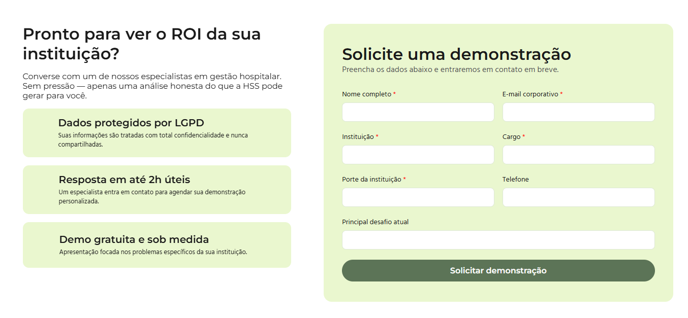
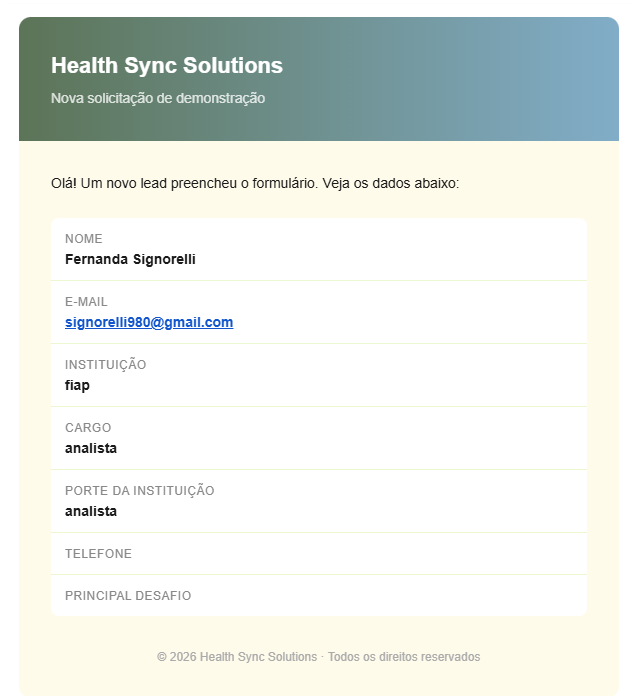
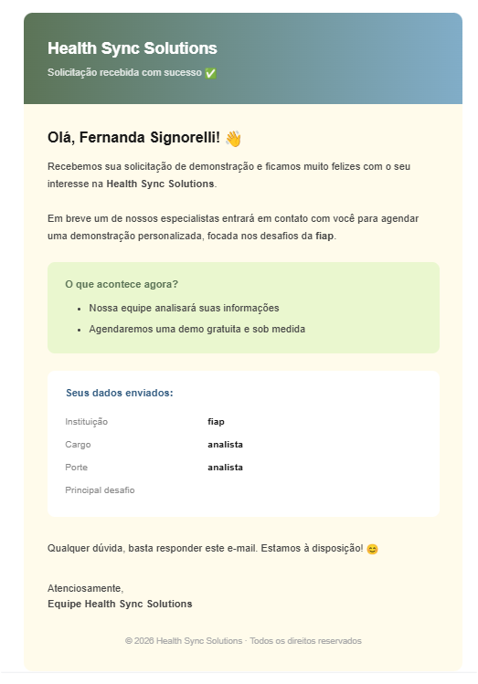

# 🏥 Health Sync Solutions — Landing Page

Landing page institucional da **Health Sync Solutions**, plataforma que digitaliza e automatiza o credenciamento médico com segurança, conformidade e rastreabilidade.

---

## 📋 Sobre o Projeto

A HSS transforma o processo manual de credenciamento de profissionais de saúde em hospitais e clínicas, eliminando fraudes, reduzindo burocracia e acelerando o onboarding médico.

Esta landing page foi desenvolvida com **HTML5, CSS3 e JavaScript puro**, sem frameworks, com foco em fidelidade ao design, responsividade e boas práticas de código.

---

## 🎨 Design

| Decisão | Escolha |
|---|---|
| Tipografia display | Lora |
| Tipografia headings | Montserrat |
| Tipografia corpo | Hind Madurai |
| Paleta principal | Verde, Azul e Creme |
| Ícones | Lucide Icons |

### 🎨 Paleta de Cores

```css
--color-lime-light: #EAF7CF;
--color-green-mid:  #5C7457;
--color-blue-deep:  #335C81;
--color-blue-soft:  #81ADC8;
--color-cream:      #FFFBEB;
```

---

## 🗂️ Estrutura do Projeto

```
health-sync-solutions/
├── index.html
├── style.css
├── script.js
├── README.md
└── img/
    ├── logotipo.png
    ├── favicon.png
    ├── telemedicine.png
    ├── telemedicine-digital.png
    ├── heart.png
    ├── etapas.png
    ├── check.png
    ├── riscos.png
    ├── onboarding.png
    ├── fraude.png
    ├── protection.png
    ├── leitura.png
    ├── dashboard.png
    ├── form.png
    ├── form-enviado.png
    ├── email-recebido.png
    └── email-usuario.png
```

---

## 📄 Seções da Página

| # | Seção | Descrição |
|---|---|---|
| 1 | 🧭 **Navbar** | Logo, links de navegação e CTA |
| 2 | 🦸 **Hero** | Headline principal, descrição e botões de ação |
| 3 | 📊 **Métricas** | 4 cards com números de impacto |
| 4 | ⚠️ **Problema** | Risco operacional na burocracia manual |
| 5 | 📋 **Lista de Problemas** | Riscos legais, onboarding lento e fraudes |
| 6 | 💡 **Solução** | Onboarding ágil, seguro e em conformidade |
| 7 | ⚙️ **Funcionalidades** | Validação em tempo real, OCR, repositório digital e painel |
| 8 | 🗺️ **Etapas** | Diagrama do fluxo de credenciamento |
| 9 | 📬 **CTA + Formulário** | Solicitação de demonstração com envio de e-mails |
| 10 | 🔗 **Footer** | Links institucionais e copyright |

---

## 🚀 Como Rodar Localmente

```bash
# Clone o repositório
git clone https://github.com/fesignorelli/health-sync-solutions.git

# Entre na pasta
cd health-sync-solutions

# Abra o arquivo no navegador
open index.html
# ou arraste o index.html para o navegador
```

> 💡 Recomenda-se usar a extensão **Live Server** no VS Code para melhor experiência de desenvolvimento.

---

## 📱 Responsividade

O layout é responsivo e adapta-se a diferentes tamanhos de tela:

- 🖥️ **Desktop** — grid de múltiplas colunas, layout completo
- 📱 **Mobile** (≤ 900px) — colunas empilhadas, imagens redimensionadas, navegação com menu hambúrguer

---

## 🛠️ Tecnologias Utilizadas

-  Estrutura semântica
-  Estilização com variáveis CSS e animações
-  Interatividade e integração com APIs
-  Lora · Montserrat · Hind Madurai
- **Lucide Icons** — ícones SVG leves e modernos
- **EmailJS** — envio de e-mails direto do frontend

---

## ⚙️ JavaScript — `script.js`

O arquivo `script.js` é responsável por três funcionalidades principais:

### 🍔 Menu Mobile (Nav Toggle)
Controla a abertura e fechamento do menu hambúrguer em telas menores:
- Alterna o ícone entre `menu` e `x` ao clicar
- Fecha o menu ao clicar em um link de navegação
- Fecha o menu ao clicar fora dele
- Animação em cascata nos itens com `transition-delay`

### 👁️ Animações de Scroll
Utiliza a **Intersection Observer API** para disparar animações de entrada conforme o usuário rola a página:
- Observa todos os elementos com a classe `.animate`
- Adiciona a classe `.visible` ao entrar no viewport
- A animação ocorre **apenas uma vez** por elemento (`unobserve` após disparar)

### 📬 Formulário de Captação de Lead
Integrado com o **EmailJS** para envio de e-mails sem backend:
- Coleta os dados dos campos e envia via `emailjs.send()`
- Dispara **dois e-mails simultâneos** ao submeter:
  - 📩 **Notificação interna** — e-mail para a equipe HSS com todos os dados do lead
  - ✅ **Confirmação ao usuário** — e-mail automático para quem preencheu o formulário
- Bloqueia reenvio usando **localStorage** — o formulário é substituído por uma mensagem de confirmação caso o usuário já tenha enviado anteriormente
- Exibe feedback visual durante o envio (`Enviando...`) e em caso de erro

#### Formulário disponível para preenchimento



#### Notificação de envio bem-sucedido


---

## 📧 Envio de E-mails — EmailJS

O formulário utiliza o **[EmailJS](https://emailjs.com)** para enviar e-mails diretamente do frontend, sem necessidade de backend ou servidor.

### Como funciona

```
Usuário preenche o formulário
        ↓
JavaScript coleta os dados
        ↓
emailjs.send() → Template "Contact Us"  →  E-mail para a equipe HSS
emailjs.send() → Template "Auto-Reply"  →  E-mail de confirmação para o usuário
```

### Templates de E-mail

| Template | Destinatário | Conteúdo |
|---|---|---|
| **Contact Us** | Equipe HSS | Todos os dados do lead em tabela estilizada com header em gradiente |
| **Auto-Reply** | Usuário | Confirmação personalizada com nome, dados enviados e próximos passos |

#### 📩 E-mail recebido pela equipe HSS



#### ✅ E-mail de confirmação recebido pelo usuário



### Configuração

As credenciais estão no `script.js`:

```javascript
emailjs.init('PUBLIC_KEY');
emailjs.send('SERVICE_ID', 'TEMPLATE_ID', dados);
```

> ⚠️ Para produção, configure os **Allowed Origins** no painel do EmailJS em `Account → Security` para restringir o uso ao domínio do seu site e evitar uso indevido da chave pública.

---

## ✨ Funcionalidades

- ✅ Variáveis CSS globais (cores, tipografia, tamanhos)
- ✅ Animações de entrada com `fadeUp` e `fadeLeft`
- ✅ Animações de scroll com Intersection Observer API
- ✅ Menu mobile com animação de abertura em cascata
- ✅ Hover states em cards, botões e links
- ✅ Grid layout responsivo
- ✅ Gradiente no footer com as cores da paleta
- ✅ Formulário de captação de leads com EmailJS
- ✅ E-mail automático de confirmação para o usuário
- ✅ Bloqueio de reenvio via localStorage
- ✅ Navegação suave com `scroll-behavior: smooth`

---

[](https://github.com/fesignorelli)
